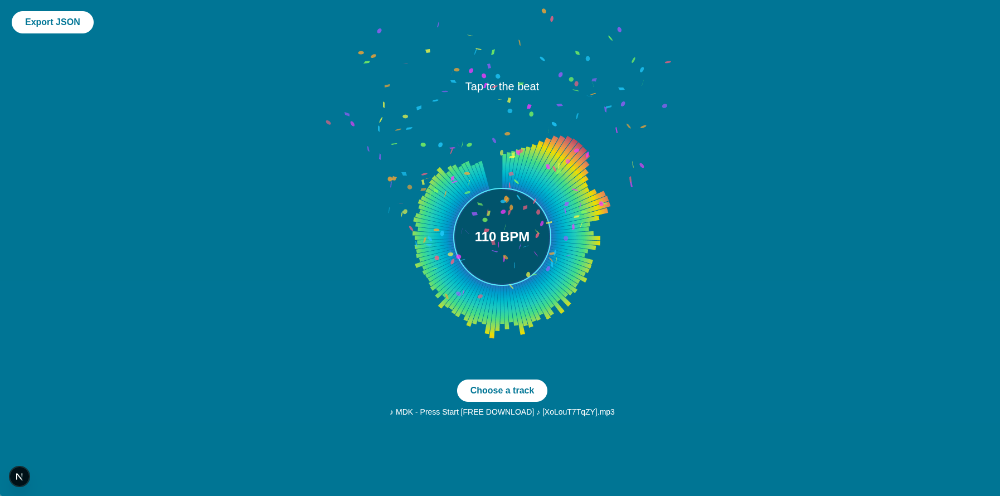

# Beatmapper 
Map your beats to the music and export as Json.





# Tech Used:
 - TypeScript
 - Next.js 
 - Tailwind CSS 
 - AudioMotion Analyzer 

## How to use
1. Choose a track(local audio file for eg,mp3) 
2. Press **Space** to start playback
3. Press **Space** on every beat to tap along — BPM updates live
4. Click **Export JSON** to download your beat map

## Installation

```bash
git clone https://github.com/AaravAtGit/beatmapper.git
cd beatmapper

npm install

npm run dev
```


---

Made with 🩵 by [AaravAtGit](https://github.com/AaravAtGit/).
