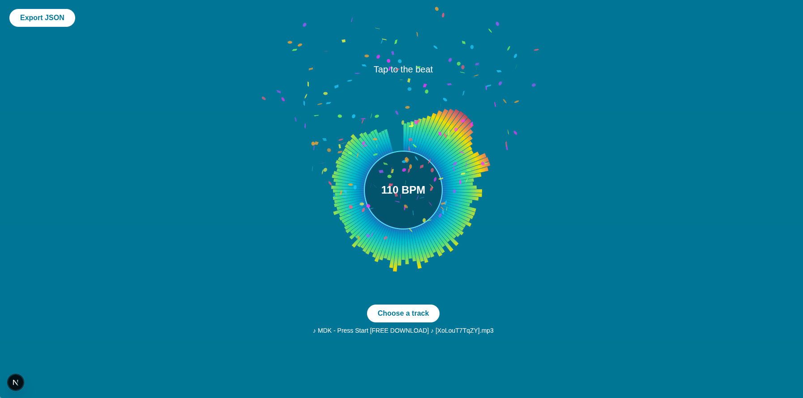

# Beatmapper 
Map your beats to the music and export as JSON.
Beatmapper is a website where you can upload your music, then use the space key to map beats to time, and download a beatmap for your games and get the BPM for the song(depends on your accuracy) 




# Tech Used:
 - TypeScript
 - Next.js 
 - Tailwind CSS 

## How to use
1. Choose a track(local audio file for eg,mp3) 
2. Press **Space** to start playback
3. Press **Space** on every beat to tap along(BPM updates live, takes last 8 taps to calculate current BPM)
4. Click **Export JSON** to download your beat map after the song is over. 

## Installation

```bash
git clone https://github.com/AaravAtGit/beatmapper.git
cd beatmapper

npm install

npm run dev
```


---

Made with 🩵 by [AaravAtGit](https://github.com/AaravAtGit/).
